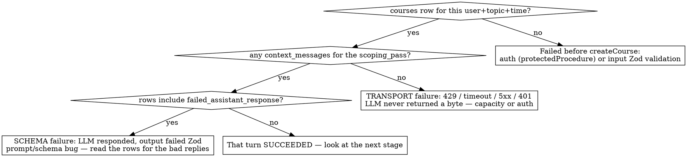

# Debugging the Nalu LLM Pipeline

## Overview

Nalu's LLM-backed tRPC procedures fail in a small, recognisable set of ways. The error the browser shows is almost never the root cause — it's a symptom layers above a transport failure, a rate-limit wall, or a schema-validation miss. **The production DB is the source of truth**: it records exactly how far each request got. Read it before theorising.

The call stack for every scoping/teaching turn:

`tRPC procedure` (`src/server/routers/`) → `lib step` (`src/lib/course/*.ts`) → `executeTurn` (`src/lib/turn/executeTurn.ts`) → `generateChat` (`src/lib/llm/generate.ts`) → AI SDK `generateText`.

**Use for:** a hosted request that hangs then errors; errors mentioning retries, 429, 401, or `INTERNAL_SERVER_ERROR`; a course stuck at `status = scoping`.
**Not for:** local unit/integration test failures (those mock the LLM), or pure UI bugs with no server call.

## Step 0 — Gather the inputs

Before touching the DB, get these from the user — ask outright, don't guess:

- A **row locator**, strongest first: **course ID** (unambiguous) → **topic name** (the inspector's overview lists topics, but a topic can match several attempts) → **user_id** (weakest, especially in dev — most courses belong to the seeded dev user `a0000000-0000-4000-8000-000000000001`). Ask for the course ID if you can get it.
- The **exact error string** the browser showed, verbatim — once the DB confirms a transport failure, this string is the _only_ thing that separates 429 vs timeout vs 401 (Step 1).
- **Roughly when** it happened — sizes the inspector's time window (Step 3).
- Which **stage** they were on (topic entry, baseline submit, a teaching turn) — narrows which procedure to inspect.

Partial info is fine — the DB fills most gaps — but a course locator and the error string save the most time.

## Step 1 — Decode the error string

| Symptom                                           | Origin                                                      | Meaning                                                                                                                                 |
| ------------------------------------------------- | ----------------------------------------------------------- | --------------------------------------------------------------------------------------------------------------------------------------- |
| `Failed after N attempts. Last error: X`          | AI SDK `retry-with-exponential-backoff` (`node_modules/ai`) | Transport retries exhausted. **N = `LLM.maxRetries` + 1.** Confirm origin: `rg "Failed after" node_modules/ai`                          |
| `Too Many Requests` / HTTP 429                    | Cerebras free tier (5 RPM, 30k TPM, 1M TPD)                 | Rate-limit wall — capacity, not a code bug                                                                                              |
| HTTP 401                                          | Auth                                                        | Either the anon-session proxy didn't mint a Supabase session, or `LLM_API_KEY`'s `op://` ref wasn't resolved → Cerebras rejects the key |
| HTTP 500 / `INTERNAL_SERVER_ERROR`, no server log | tRPC procedure threw                                        | Nothing calls `console.error` — the failure is silent. Reconstruct from the DB, not the logs                                            |

The tRPC error envelope carries `data.path` (e.g. `course.clarify`) and `data.httpStatus` — that names the failing procedure.

## Step 2 — Do the retry math

Two nested retry layers multiply:

- **Transport** (`generateChat` → `generateText`): `LLM.maxRetries` in `src/lib/config/tuning.ts` (currently `6` → 7 attempts). Exponential backoff ≈ 2+4+8+16+32+64s ≈ **126s** — this is the "~2-minute hang".
- **Validation** (`executeTurn`): `SCOPING.maxParseRetries` in `tuning.ts` (currently `2` → 3 logical attempts). Only retries on `ValidationGateFailure` (bad JSON / Zod miss).

A pure 429 is a _transport_ error → it propagates out of `executeTurn` untouched, burning exactly one validation attempt's worth of transport retries (7) and persisting **nothing**. A schema miss burns up to 3 logical attempts and _does_ persist a failure trail.

> The comment block above `LLM.maxRetries` in `tuning.ts` mentions a "30-RPM" Cerebras tier — that figure is **stale**. The real free tier is 5 RPM (see Step 1).

## Step 3 — Inspect the production DB

`.env.local`'s `DATABASE_URL` points at the **production** Supabase (pooled, PgBouncer). `psql` isn't installed — use the bundled read-only inspector (the `postgres` package is already a project dep; `bun` auto-loads `.env.local`):

```bash
bun .claude/skills/debugging-nalu-llm-pipeline/inspect-db.ts --minutes 30                  # overview, last 30 min
bun .claude/skills/debugging-nalu-llm-pipeline/inspect-db.ts --since 2026-05-21T19:00:00Z  # overview from an absolute time
bun .claude/skills/debugging-nalu-llm-pipeline/inspect-db.ts --course <uuid>               # drill into one course
```

**Size the window to the incident.** `--minutes` looks back from _now_; for anything older than ~30 min, pass a larger `--minutes` or use `--since <ISO>` — otherwise the overview shows nothing and you misdiagnose.

The overview's scoping-passes table carries the diagnosis directly via its `msgs` / `failed` / `ok` columns (see Step 4). The `--course` mode prints every `context_messages` row with a content preview — how you recover **the actual prompts and the failed model replies** — plus the scoping-close lifecycle tables (baseline JSONB shape, waves with `chatlog_entries`, concepts) and the **wave teaching turns** — everything needed for submitBaseline and wave-turn failures.

## Step 4 — Read DB state: the diagnosis decision tree

The lib step calls `createCourse` **before** the LLM call, so a `courses` row exists even on total failure. How far the row got tells you the failure class:



Read the inspector's scoping-passes table (`msgs` / `failed` / `ok` columns) onto the tree:

- **`courses` + `scoping_pass` rows exist, `msgs = 0`** → transport failure. The LLM never returned a byte (429 / timeout / 5xx / 401).
- **`failed > 0`** → the LLM _did_ respond; its output failed Zod validation. Schema/prompt bug, not capacity — read the bad replies with `--course`.
- **`ok > 0`, `clarification` populated** → that turn succeeded; look at the next stage.
- **No `courses` row at all** → failed before `createCourse`: auth (`protectedProcedure` rejected) or input Zod validation.

`context_messages.kind` vocabulary: `user_message`, `assistant_response`, `failed_assistant_response`, `harness_retry_directive`. The presence of `failed_*` / `harness_retry_directive` rows is the schema-vs-transport tell.

### Failures past clarify (framework, baseline, submitBaseline)

The tree above is per-**turn**, not per-pass: one scoping pass holds every scoping turn, so it can carry 20+ rows from earlier successful turns while the _failing_ turn persisted nothing. First identify the failing **stage** from the `courses` row — `has_clarification` / `has_framework` / `has_baseline` show how far scoping got, and `status = 'scoping'` with `has_baseline = true` means the failing stage is **submitBaseline** (the scoping-_close_ step) — then apply the tree to that stage's turn.

`submitBaseline` is special: it writes the learner's answers into the `baseline` JSONB **before** its LLM call, so `updated_at` bumps and `baseline.responses` fills even on failure. Run `inspect-db.ts --course <id>` and read its lifecycle tables:

| State                                                                                                   | Meaning                                                                         |
| ------------------------------------------------------------------------------------------------------- | ------------------------------------------------------------------------------- |
| `baseline.widened = true`, a Wave row exists, concepts > 0, `status = active`                           | submitBaseline succeeded                                                        |
| `baseline.responses` filled but `widened = false`, 0 waves, 0 concepts, `status = scoping`, no new turn | the close LLM call **transport-failed** — answers saved, nothing else committed |
| a fresh turn with a `failed_assistant_response` trail                                                   | the close call **schema-failed**                                                |

Recovery for a transport-failed close: it is **safe to retry** — `submitBaseline` re-reads state and is idempotent, and `persistScopingClose` is a single transaction (no partial commit). Resubmitting the baseline finishes the course once the transport blip clears.

### Post-persist failures (wave teaching turns)

A third class, beyond transport and schema. `executeTurn` commits its `context_messages` batch atomically and returns — but the lib step does **more** afterward, in a separate transaction: `executeWaveMid` / `executeWaveClose` grade answers, insert `assessments`, upsert concepts, and append the assistant entry to `waves.chat_log`. If that post-LLM work throws, the turn **500s even though `context_messages` shows a clean `assistant_response`** — so the decision tree's "succeeded" leaf is not the end of the story for a wave turn.

The tell: `inspect-db.ts --course` prints WAVE CONTEXT MESSAGES plus a `chatlog_entries` count per wave. A turn with a committed `assistant_response` that is **not** reflected in `chat_log` (the count is short) is a post-persist failure — the LLM replay log and the UI log have diverged. The error is a thrown `Error` surfaced verbatim in the 500's `message` (e.g. `executeWaveMid: questionnaire question id=q2 missing required conceptName`), and `data.path` is `wave.submitTurn`. Read the lib step — `executeWaveMid` plus its `.grade.ts` / `.insert.ts` — for the `throw`. The LLM call itself succeeded; the bug is in deterministic post-LLM persistence.

## Step 5 — Cross-reference

- `git log` / recent PRs — a public-facing change (e.g. anonymous auth) multiplies LLM load against a fixed rate limit.
- The rate limiter (`src/lib/llm/cerebrasRateLimit.ts`) is **in-process module state** — racy across Vercel serverless instances, so per-instance pacing ≠ global pacing. The Cerebras key is also shared with the user's STT workload.

## Common mistakes

- **Leaking secrets.** Never pipe `.env.local` through a redaction `sed` — BSD `sed` ≠ GNU `sed`, and a wrong pattern prints the value verbatim. List variable _names_ only: `rg -o '^[A-Z_]+=' .env.local`. (A past session leaked the production DB password this way.)
- Treating the browser error as the root cause. It's a symptom — go to the DB.
- Expecting Vercel runtime logs to explain a silent 500. They won't — there is no `console.error`.
- Forgetting `course.clarify` has no dedup: each call (and each user retry) creates a fresh `courses` row + a new LLM burst, multiplying load against the rate limit.

## Quick reference

| Want to know                           | Where                                                                   |
| -------------------------------------- | ----------------------------------------------------------------------- |
| How many transport retries             | `LLM.maxRetries` in `src/lib/config/tuning.ts`                          |
| How many validation retries            | `SCOPING.maxParseRetries` in `tuning.ts`                                |
| What the prompts / failed replies were | `context_messages` rows for the scoping pass (`inspect-db.ts --course`) |
| Which procedure failed                 | tRPC error envelope `data.path`                                         |
| Did the LLM respond at all             | presence of any `context_messages` row for the pass                     |
| Rate-limit ceiling                     | 5 RPM / 30k TPM / 1M TPD (Cerebras free tier)                           |
